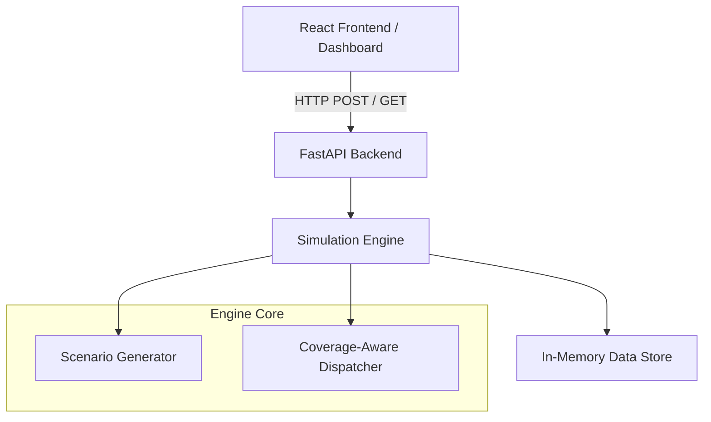

# Technical Design

## System Architecture

## Simulation Engine
The engine operates on a deterministic tick-based loop (`t=0` to `t=120`). At each minute, it:
1. Frees vehicles that have completed their service.
2. Reveals newly arrived incidents into the causal state.
3. Compiles the waiting queue.
4. Generates a secure, read-only `SimulationState` snapshot.
5. Invokes the Dispatcher.
6. Applies valid assignments and updates vehicle/incident objects.

## Dispatcher
The dispatcher is injected into the engine via a standard `DispatcherInterface`. It reads the `SimulationState` and returns a list of `(incident_id, vehicle_id)` tuples. The baseline uses a simple Nearest-Idle algorithm, while the primary solution uses the Coverage-Aware algorithm.

## Causal Information Boundary
Strict algorithmic causality is enforced structurally. The `SimulationState` passed to the dispatcher is a deep-copied snapshot containing *only* revealed incidents and current idle vehicles. The dispatcher mathematically cannot access `engine.all_incidents` (future events). This has been formally proven by the `test_causality_strict.py` suite.

## Assignment Scoring & Coverage Preservation
Rather than hardcoding quadrant logic, the dispatcher calculates a `cost` function. It penalizes assignments that leave a quadrant empty (Coverage Penalty) and gently guides the system away from quadrants with low vehicle counts (Scarcity Penalty). These penalties are dynamically divided by the incident's priority weight, naturally allowing critical (Priority 1) incidents to violate coverage rules if necessary to save a life, while forcing low-priority incidents to preserve grid integrity.

## Metric Calculations
Metrics are derived purely from simulation outputs, completely decoupled from the dispatcher logic. 
- **Weighted Response**: `sum(response_time * priority_weight) / sum(priority_weight)`
- **Coverage Outage**: `1` if any quadrant has `0` idle vehicles at the end of minute `t`, else `0`.

## Data Flow & Error Handling
1. **Frontend**: Forms submit strict types to FastAPI.
2. **Backend**: Pydantic validates boundaries and types. Unknown inputs throw `422 Unprocessable Entity`.
3. **Engine**: If the dispatcher returns an invalid assignment (e.g. assigning a busy vehicle, assigning an unrevealed incident), the engine logs the `invalid_assignment_attempt` in validation metrics and gracefully discards the tuple, preventing corruption.
